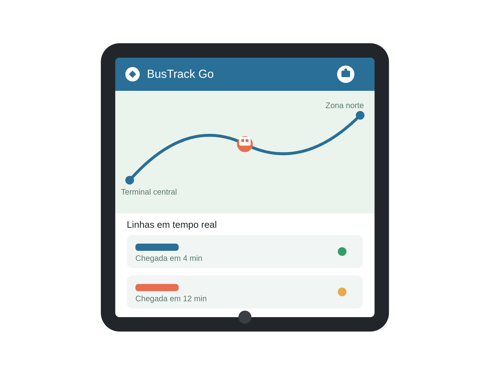

# BusTrack Go

Aplicação de gerenciamento de transporte urbano desenvolvida com **Go, Vue.js e Oracle Database**.



O BusTrack Go foi desenvolvido como projeto de aprendizado prático e portfólio, evoluindo de uma API HTTP simples para uma aplicação full stack com persistência em banco de dados, testes automatizados, Docker e interface web.

**Status: Concluído**

## Aplicação publicada

**Frontend:**
https://bus-track-go-frontend.onrender.com/

**Backend / API:**
https://bus-track-go.onrender.com/

**Health Check:**
https://bus-track-go.onrender.com/health

## Funcionalidades

* Cadastro, consulta, edição e exclusão de ônibus;
* alteração do status dos ônibus;
* cadastro e listagem de linhas;
* cálculo da média de passageiros por linha;
* registro e listagem de viagens;
* persistência dos dados em Oracle Database;
* API REST desenvolvida em Go;
* frontend desenvolvido com Vue.js;
* integração entre frontend, backend e banco de dados;
* validação de dados e tratamento de erros;
* testes automatizados dos handlers HTTP;
* execução do Oracle Database em container Docker no ambiente local.

## Tecnologias

### Backend

* Go
* `net/http`
* `encoding/json`
* `database/sql`
* Oracle Database
* Oracle Instant Client
* `github.com/godror/godror`
* Docker
* Git

### Frontend

* Vue 3
* JavaScript
* Vue Router
* Fetch API
* Vite
* CSS

## Arquitetura

A aplicação utiliza uma arquitetura simples, organizada de acordo com as necessidades que surgiram durante o desenvolvimento.

```text
Vue.js
   ↓
Fetch API
   ↓
Go HTTP API
   ↓
Repository
   ↓
Oracle Database
```

O frontend é responsável pela interface e pela comunicação HTTP com a API.

A API Go concentra os handlers HTTP, validações e regras necessárias para atender às requisições.

A camada `repository` concentra as operações de persistência no Oracle Database.

O domínio contém as entidades utilizadas pela aplicação:

```text
Bus
Line
Trip
```

Não foi adicionada uma camada Service. A decisão foi manter a arquitetura proporcional ao tamanho e ao objetivo do projeto, evitando abstrações sem uma necessidade concreta.

## Estrutura do projeto

```text
bus-track-go/

├── backend/
│   ├── database/
│   │   └── oracle.go
│   ├── domain/
│   │   ├── bus.go
│   │   ├── bus_test.go
│   │   ├── line.go
│   │   ├── line_test.go
│   │   ├── trip.go
│   │   └── trip_test.go
│   ├── repository/
│   │   ├── bus_repository.go
│   │   ├── line_repository.go
│   │   └── trip_repository.go
│   ├── go.mod
│   ├── go.sum
│   ├── main.go
│   ├── main_test.go
│   └── start.sh
│
├── frontend/
│   ├── src/
│   │   ├── components/
│   │   │   └── BusList.vue
│   │   ├── router/
│   │   │   └── index.js
│   │   ├── views/
│   │   │   └── HomeView.vue
│   │   ├── App.vue
│   │   └── main.js
│   ├── package.json
│   ├── package-lock.json
│   └── vite.config.js
│
├── .env.example
├── .dockerignore
├── .gitignore
├── LICENSE
├── README.md
└── .github/
    └── workflows/
        └── ci.yml
```

## Banco de dados

O projeto utiliza **Oracle Database** como banco de dados relacional principal.

A comunicação entre Go e Oracle utiliza:

```text
Go
 ↓
database/sql
 ↓
godror
 ↓
Oracle Instant Client
 ↓
Oracle Database
```

O projeto utiliza o Oracle Instant Client para disponibilizar as bibliotecas nativas necessárias à comunicação com o banco.

As operações de persistência são realizadas pela camada `repository`.

### Ambiente local

No ambiente local, o Oracle Database é executado através de Docker.

### Ambiente de produção

A versão publicada utiliza uma instância Oracle Database hospedada na Oracle Cloud.

A aplicação Go conecta-se ao banco utilizando Oracle Wallet e as variáveis de ambiente configuradas no ambiente de produção.

Credenciais e arquivos do Oracle Wallet não são armazenados no repositório.

## Docker

O Oracle Database utilizado no ambiente de desenvolvimento é executado em um container Docker.

O container utilizado pelo projeto possui:

```text
Nome: bustrack-oracle
Porta: 1521
Service Name: FREEPDB1
```

Para iniciar um container Oracle já criado:

```bash
docker start bustrack-oracle
```

Caso o nome do container seja diferente no ambiente local:

```bash
docker ps -a
```

## Configuração do ambiente

### Backend

A aplicação Go utiliza as seguintes variáveis:

```text
ORACLE_USER
ORACLE_PASSWORD
ORACLE_CONNECT_STRING
CORS_ORIGIN
```

Um arquivo `.env.example` está disponível no projeto como referência.

O arquivo `.env` não é versionado pelo Git.

Para verificar se o arquivo está sendo ignorado:

```bash
git check-ignore -v .env
```

### Frontend

O frontend utiliza:

```text
VITE_API_URL
```

No ambiente local:

```text
VITE_API_URL=http://localhost:8080
```

Em produção:

```text
VITE_API_URL=https://bus-track-go.onrender.com
```

## Como executar o projeto localmente

Para executar a aplicação localmente, é necessário ter instalado:

* Go;
* Node.js;
* npm;
* Docker;
* Oracle Instant Client.

O Oracle Database é executado através do Docker.

### 1. Iniciar o Oracle Database

```bash
docker start bustrack-oracle
```

Confirme se o container está em execução:

```bash
docker ps
```

O Oracle deve estar disponível na porta:

```text
1521
```

utilizando o service name:

```text
FREEPDB1
```

### 2. Executar o backend Go

Acesse o diretório do backend:

```bash
cd ~/projetos/bus-track-go/backend
```

Configure as variáveis de ambiente:

```bash
export ORACLE_USER=system
export ORACLE_PASSWORD=<sua_senha>
export ORACLE_CONNECT_STRING=localhost:1521/FREEPDB1
export CORS_ORIGIN=http://localhost:5173
```

Execute a API:

```bash
go run .
```

A API ficará disponível em:

```text
http://localhost:8080
```

Health check:

```text
GET http://localhost:8080/health
```

Resposta esperada:

```json
{
  "status": "ok"
}
```

### 3. Executar o frontend Vue.js

Em outro terminal:

```bash
cd ~/projetos/bus-track-go/frontend
```

Instale as dependências:

```bash
npm install
```

Execute o servidor de desenvolvimento:

```bash
npm run dev
```

O Vite exibirá no terminal o endereço local da aplicação, normalmente:

```text
http://localhost:5173
```

O frontend se comunica com a API Go através da Fetch API.

## API

### Health Check

```http
GET /health
```

Retorna o estado da API.

### Ônibus

```http
GET    /api/buses
GET    /api/buses/{id}
POST   /api/buses
PUT    /api/buses/{id}
DELETE /api/buses/{id}
```

As operações permitem cadastrar, consultar, editar e excluir ônibus.

### Linhas

```http
GET  /api/lines
POST /api/lines
```

As linhas possuem informações relacionadas ao itinerário e permitem apresentar a média de passageiros registrada para cada linha.

### Viagens

```http
GET  /api/trips
POST /api/trips
```

As viagens podem ser registradas e consultadas através da API.

Após o registro de uma viagem, o frontend atualiza a interface para apresentar imediatamente o novo registro.

## Testes

O backend possui testes automatizados utilizando recursos da biblioteca padrão do Go.

Foram utilizados:

* `testing`;
* `net/http/httptest`;
* Fake Repository.

Os testes cobrem handlers HTTP, validações, respostas de sucesso, registros inexistentes e erros de persistência.

Para executar os testes:

```bash
cd ~/projetos/bus-track-go/backend
go test ./...
```

Para executar os testes com detalhes:

```bash
go test -v ./...
```

Para verificar a compilação:

```bash
go build ./...
```

## Integração Contínua

O projeto utiliza **GitHub Actions** para executar automaticamente:

* testes do backend Go;
* build do frontend Vue.js.

O workflow é executado em pushes para `main` e `deploy-render` e em Pull Requests direcionados para `main`.

## Deploy e publicação

O projeto está publicado utilizando o Render.

A arquitetura de produção é:

```text
Usuário
   ↓
Frontend Vue.js
   ↓
Render Static Site
   ↓
Go REST API
   ↓
Render Web Service
   ↓
Oracle Database
   ↓
Oracle Cloud
```

### Frontend

O frontend Vue.js é publicado como Static Site.

URL:

```text
https://bus-track-go-frontend.onrender.com/
```

### Backend

A API Go é executada como Web Service.

URL:

```text
https://bus-track-go.onrender.com/
```

Health check:

```text
https://bus-track-go.onrender.com/health
```

### Configuração de produção

O frontend utiliza:

```text
VITE_API_URL=https://bus-track-go.onrender.com
```

O backend utiliza `CORS_ORIGIN` apontando para o endereço do frontend.

As credenciais do banco e o Oracle Wallet são configurados como variáveis e arquivos secretos no ambiente de produção.

Nenhuma credencial sensível é armazenada no código-fonte.

## Histórico de desenvolvimento

### Aula 1 — Inicialização

Criação da estrutura inicial do projeto, configuração do módulo Go, aplicação inicial e integração com Git e GitHub.

### Aula 2 — API HTTP

Criação da primeira API HTTP utilizando a biblioteca padrão do Go, incluindo rota de health check, métodos HTTP, status codes e respostas JSON.

### Aula 3 — Domínio

Criação do domínio `Bus`, definição dos seus atributos e primeiros testes de serialização e desserialização JSON.

### Aula 4 — CRUD em memória

Implementação das operações de criação, consulta, atualização e exclusão de ônibus utilizando armazenamento temporário em memória.

### Aula 5 — Persistência com Oracle

Integração da aplicação Go com Oracle Database utilizando `database/sql`, `godror` e Oracle Instant Client.

### Aula 6 — Repository

Separação das operações de persistência em repositories específicos para reduzir o acoplamento entre HTTP e banco de dados.

### Aula 7 — Validação e erros

Implementação de validações, tratamento de entradas inválidas, registros inexistentes e respostas HTTP apropriadas.

### Aula 8 — Testes da API

Criação de testes automatizados para os handlers HTTP utilizando `httptest` e Fake Repository, permitindo testar a API sem depender diretamente do Oracle.

### Aula 9 — Docker

Configuração do Oracle Database em container Docker e utilização de variáveis de ambiente para configuração da conexão.

### Aula 10 — Frontend Vue.js

Criação do frontend utilizando Vue.js, Vue Router, JavaScript e Fetch API, com integração à API Go.

### Aula 11 — CRUD no Vue

Ampliação do frontend para gerenciamento de ônibus, cadastro e consulta de linhas e registro e consulta de viagens, incluindo integração completa com o Oracle Database.

### Aula 12 — Fechamento e documentação

Revisão final da estrutura, validação da aplicação, documentação da arquitetura, registro das decisões técnicas e preparação do projeto para publicação.

## Evolução do projeto

```text
Go
 ↓
HTTP
 ↓
Domínio
 ↓
CRUD
 ↓
Oracle
 ↓
Repository
 ↓
Validação e tratamento de erros
 ↓
Testes
 ↓
Docker
 ↓
Vue.js
 ↓
CRUD no frontend
 ↓
Linhas e viagens
 ↓
Integração frontend/backend
 ↓
Deploy
```

## Decisões técnicas

### Biblioteca padrão do Go

A API utiliza principalmente recursos da biblioteca padrão do Go, evitando a adoção de um framework HTTP sem uma necessidade concreta.

### Repository

A camada Repository foi introduzida quando a persistência passou a ser responsabilidade importante da aplicação.

### Ausência de Service

Não foi criada uma camada Service porque as operações existentes não apresentaram complexidade suficiente para justificar uma nova camada de abstração.

### Fetch API

A comunicação entre Vue.js e backend utiliza a Fetch API. Não foi adicionada uma biblioteca HTTP externa porque a necessidade do projeto é atendida pela API nativa do navegador.

### Interface simples

O frontend foi mantido propositalmente simples, priorizando a integração entre interface, API e banco de dados.

### Oracle Database

O Oracle foi utilizado como banco relacional principal para trabalhar com persistência, SQL e integração com uma tecnologia comum em ambientes corporativos.

### Deploy

Frontend e backend são publicados separadamente, enquanto o banco de dados de produção utiliza Oracle Database na Oracle Cloud.

## Objetivo do projeto

O BusTrack Go foi desenvolvido para praticar, de forma incremental, conceitos fundamentais de desenvolvimento backend e integração full stack:

* desenvolvimento de APIs REST;
* linguagem Go;
* HTTP;
* modelagem de domínio;
* persistência relacional;
* SQL;
* Repository Pattern;
* validação e tratamento de erros;
* testes automatizados;
* Docker;
* desenvolvimento frontend com Vue.js;
* integração frontend/backend;
* Git e GitHub;
* CI com GitHub Actions;
* deploy de aplicação.

O projeto prioriza uma arquitetura simples e compreensível, adicionando abstrações somente quando existe uma necessidade concreta.

## Licença

Este projeto está licenciado sob a MIT License. Consulte o arquivo [LICENSE](LICENSE) para mais informações.
